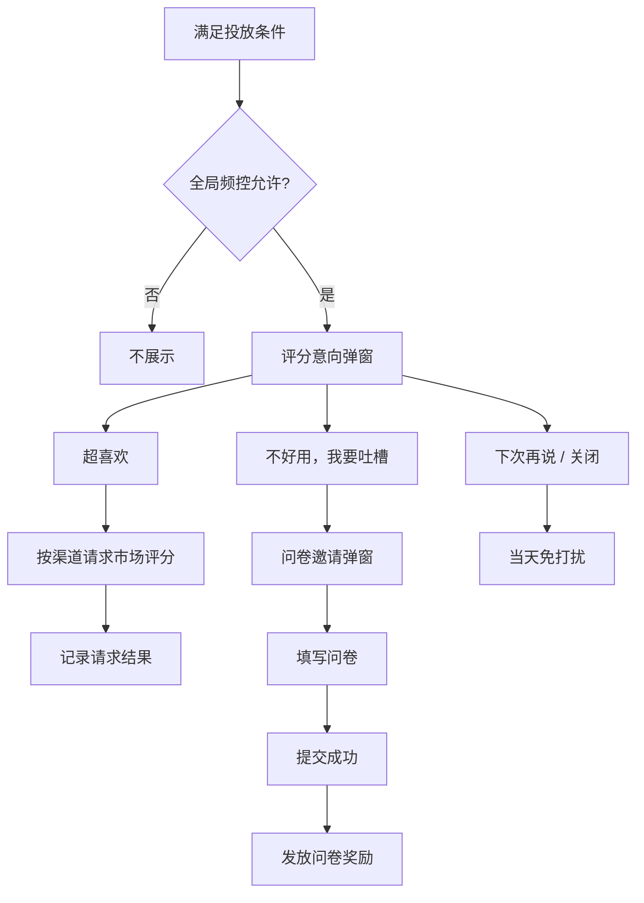

# 双师智学｜应用市场评分与问卷调研融合 PRD

| 项目 | 内容 |
| --- | --- |
| 文档版本 | V1.0 |
| 文档类型 | 产品需求文档（PRD） |
| 适用端 | iOS、Android（华为、荣耀、小米、vivo、OPPO） |
| 关联文档 | 《问卷调研（双师智学）》V0.3 |
| 目标用户 | 双师智学在学且有完课记录的学生家长 |

## 1. 背景与目标

现有问卷调研在用户进入双师智学 Tab 时直接触达，能够收集深度反馈，但对满意用户而言路径偏长；同时，应用市场评分和问卷调研的触达次数、关闭次数、奖励状态彼此独立，容易造成重复打扰。

本期将两类能力统一为一条“先评分、后挽回”的体验链路：

1. 优先在合适时机请求应用市场评分，降低高满意用户留评成本。
2. 用户明确表达负反馈意愿时，再进入问卷调研，收集可行动的问题和建议。
3. 评分与问卷共用投放人群、全局频控、活动版本与数据看板，避免同一用户被重复打扰。
4. 适配 iOS、Google Play 及国内主流安卓市场能力差异；无法应用内评分时提供可靠降级。

## 2. 范围与非目标

### 2.1 本期范围

- 双师智学 Tab 内的评分引导、负反馈分流、问卷邀请、问卷 WebView、奖励发放和埋点。
- iOS 与华为、荣耀、OPPO、小米、vivo 渠道的市场评分路由与失败降级。
- 与现有问卷活动的频次、提交状态和奖励幂等融合。

### 2.2 非目标

- 不在 App 内自行生成或代替任一应用市场的最终评分界面。
- 不保证系统/市场每次都展示评分面板；系统或市场拥有最终展示控制权。
- 不修改问卷题目、跳题规则及问卷后台的运营配置能力。

## 3. 用户与准入条件

### 3.1 投放人群

满足以下全部条件：

- 双师智学在学用户；
- 有剩余 CAI 或 TCAI 课时；
- 至少完成 1 节 CAI 或 TCAI 课程；
- 当前评分/问卷活动处于开启且未停止收集状态；
- 未命中全局免打扰、黑名单、未成年人保护或客服处置排除规则。

### 3.2 正向触发时机

仅在用户完成一个正向任务后触发候选，例如：完课结算成功、主动完成学习任务、课程评价完成后返回双师页。不得在课程播放中、支付中、出现报错后、弱网重试中或首次安装首日触发。

推荐默认阈值：近 14 天至少完成 2 节课，且本次完课成功后延迟 3–8 秒展示。

## 4. 核心用户流程



### 4.1 评分意向弹窗

文案与按钮：

| 组件 | 内容 | 行为 |
| --- | --- | --- |
| 标题 | 喜欢优学吗？ | 固定 |
| 主选项 | 超喜欢，给个好评 | 请求对应市场评分能力 |
| 负反馈选项 | 不好用，我要吐槽 | 关闭评分弹窗，进入问卷邀请弹窗 |
| 次选项 | 下次再说 | 关闭；当天不再触达 |
| 关闭按钮 | × | 与“下次再说”相同 |

**规则：**评分意向弹窗只负责“是否愿意评分”的分流；不要在此页面收集 1–5 星后再伪装成已完成市场评分。市场评分是否出现、是否提交均不能由客户端强制保证。

### 4.2 正向评分链路

点击“超喜欢，给个好评”后，客户端按第 6 节路由市场能力。

- 调用成功：记录“评分请求发起”；若系统/市场未展示，不视为失败，也不立即重复请求。
- 不支持、目标商店未安装、应用未在目标商店上架或调用异常：显示轻提示“暂时无法打开应用市场，感谢你的支持”，关闭链路；不转入问卷。
- 市场评分成功与否通常无法由 App 回传确认，因此仅统计“请求发起/拉起结果”，不得按“已评分”作为强依赖业务口径。

### 4.3 负反馈与问卷链路

点击“不好用，我要吐槽”后：

1. 立即关闭评分弹窗，展示“填写问卷，领取专属感谢礼”弹窗。
2. 点击“去填写并领取”后，在 WebView 打开当前活动配置的问卷 URL，并透传 `user_id`、`student_id`、`survey_campaign_id`、`source=rating_negative`、`channel`。
3. 问卷提交成功后，由服务端确认提交并按活动配置发放奖励；成功页显示“奖励将在 10 分钟内到账，请在个人中心查看”。
4. 关闭问卷邀请或退出 WebView仅记为未完成，不发奖励。

## 5. 统一频控与活动状态

### 5.1 统一原则

评分弹窗与问卷邀请弹窗属于同一个“体验反馈活动”，共用 `campaign_id`、触达计数和免打扰状态；但问卷完成状态与市场评分请求状态分开保存。

### 5.2 默认频控

| 场景 | 处理 | 计数 |
| --- | --- | --- |
| 评分意向弹窗曝光 | 同一活动最多展示 3 次 | `feedback_touch_count +1` |
| 关闭 / 下次再说 | 当天不再展示评分或问卷邀请 | 不额外加次数 |
| 选择“超喜欢” | 记一次市场评分请求，30 天内不再展示评分意向弹窗 | 不触发问卷计数 |
| 选择“我要吐槽” | 当次可展示问卷邀请；同一天不重复展示 | 不重复增加曝光次数 |
| 关闭问卷邀请 | 当天免打扰；总触达次数不足 3 次时，次日可再次从评分意向开始 | 不额外加次数 |
| 问卷提交成功 | 永久结束当前 `campaign_id` 的评分和问卷触达 | 完成状态由服务端记录 |
| 活动/问卷版本变更 | 以新的 `campaign_id` 重新计数；旧活动的奖励和提交状态保留 | 新活动从 0 开始 |

### 5.3 更严格的系统上限优先

- iOS：系统对同一用户的评分请求展示存在上限（最多 3 次/365 天）；业务频控不得试图绕过该限制。
- Google Play：展示配额由 Google 控制且可能变化；客户端不可根据“点击按钮”假定一定会出现评分面板。
- 国内安卓市场：以各厂商 SDK/协议的实际能力、版本要求及审核要求为准；业务频控仍执行上述统一上限。

## 6. 渠道路由与交互差异

### 6.1 路由优先级

客户端先读取“应用安装来源/渠道包标识”，再判断设备能力；不得仅凭手机品牌选择市场。若渠道不可识别，走“不支持”降级，不弹出市场选择器干扰用户。

| 平台/渠道 | 优先能力 | 用户体验 | 限制与降级 |
| --- | --- | --- | --- |
| iOS App Store | StoreKit `requestReview` | 系统内嵌评分/评论面板 | 是否展示由系统决定；最多 3 次/365 天；不可自定义最终评分 UI。 |
| Google Play（如适用） | Play In-App Review API | Google Play 内嵌评分面板 | 配额由 Google 控制；不应将 API 直接绑定为永久可点的 CTA。 |
| 华为应用市场 / HarmonyOS | 应用评论服务（符合接入条件时） | 应用内拉起评论 | 能力、版本与上架状态不满足时，跳详情页或提示失败。 |
| 荣耀应用市场 | 评论一键直达（符合接入条件时） | 直接拉起评论窗口 | 以荣耀 SDK 与合作/审核条件为准；失败则跳详情页。 |
| OPPO 软件商店 | 应用评论调起能力 | 当前页面内拉起评论窗口 | 需完成 OPPO 接入；失败则跳详情页。 |
| 小米应用商店 | 市场详情页 / 评论入口跳转 | 离开 App 至小米应用市场 | 未接入统一应用内评论能力；商店未安装或无上架应用则降级。 |
| vivo 应用商店 | 市场详情页 / 评论入口跳转 | 离开 App 至 vivo 应用商店 | 以当前开放能力和实机验证为准；失败则降级。 |

### 6.2 合规与体验要求

- 不得要求用户必须给五星才可获得课程、会员、定制币或任何权益。
- 问卷奖励只与“完成问卷”相关，不与市场星级、好评文本或市场评分提交绑定。
- 不得在用户发生异常、投诉、退款、差评或客服会话后引导市场好评。
- 市场 SDK 拉起失败须静默兜底，不重复唤起，不阻塞用户继续学习。

## 7. 配置与服务端接口

### 7.1 活动配置

| 配置项 | 说明 |
| --- | --- |
| `campaign_id` | 评分与问卷共享的活动唯一标识；变更即重置该活动频控 |
| `enabled` | 总开关 |
| `eligible_course_ids` | CAI/TCAI 课程 ID 列表 |
| `min_completed_lessons` | 完课门槛，默认 2 |
| `max_touch_count` | 最大总曝光次数，默认 3 |
| `rating_cooldown_days` | 正向评分请求后的冷却期，默认 30 天 |
| `survey_url` | 问卷 WebView 地址 |
| `survey_reward` | 奖励类型、数量、活动有效期 |
| `channel_routing` | 各渠道市场包名、App ID、URI/SDK 开关及降级策略 |

### 7.2 状态模型

客户端本地缓存用于即时频控；服务端状态为跨设备权威口径。

```text
user_id + campaign_id
├── feedback_touch_count
├── last_touch_at
├── day_suppressed_until
├── rating_request_at
├── rating_request_channel
├── survey_invite_at
├── survey_submitted_at
└── reward_granted_at
```

奖励发放必须以 `user_id + campaign_id + reward_type` 做幂等键；同一活动多次提交不得重复发放。

## 8. 埋点设计

所有事件增加公共属性：`campaign_id`、`source`、`channel`、`device_brand`、`os`、`app_version`、`student_id`（脱敏/合规处理后）。

| event_id | 触发时机 | 关键属性 |
| --- | --- | --- |
| `feedback_eligibility_hit` | 命中/未命中投放资格 | `result`, `reason` |
| `feedback_rating_popup_show` | 评分意向弹窗曝光 | `touch_count` |
| `feedback_rating_click_positive` | 点击“超喜欢” |  |
| `feedback_rating_request` | 调用市场评分能力 | `market`, `route_type`, `result`, `error_code` |
| `feedback_rating_click_negative` | 点击“我要吐槽” |  |
| `feedback_rating_dismiss` | 下次再说、关闭或点空白 | `dismiss_type` |
| `feedback_survey_invite_show` | 问卷邀请曝光 | `source=rating_negative` |
| `feedback_survey_invite_click` | 点击去填写 |  |
| `feedback_survey_webview_loaded` | 问卷加载成功 | `survey_url_version` |
| `feedback_survey_submit_confirmed` | 服务端确认问卷提交 |  |
| `feedback_reward_grant` | 奖励发放 | `result`, `reward_type`, `reward_amount` |

## 9. 验收标准

1. 满足人群条件的用户先看到评分意向弹窗；选择负反馈后才展示问卷邀请。
2. 同一 `campaign_id` 下，评分与问卷入口合计最多触达 3 次；关闭后当天不再打扰。
3. 问卷提交成功后，不再展示该活动的评分和问卷入口，且奖励仅发放一次。
4. iOS、华为、荣耀、OPPO 的应用内能力在条件满足时优先拉起；小米、vivo 进入对应市场详情页；全部失败路径均不崩溃、不死循环。
5. 奖励与“问卷完成”绑定，不与市场评分星级或评论内容绑定。
6. 所有路由、失败原因、频控命中、问卷完成和奖励结果均可在埋点中还原。

## 10. 风险与待确认项

- 华为、荣耀、OPPO 的能力接入资格、SDK 版本、渠道上架状态及审核要求需由客户端与渠道运营在联调前确认。
- 小米、vivo 是否存在可用的评论直达能力需以最新开放平台文档与目标机型实测为准；未确认前按“跳详情页”设计。
- 需要确认现有问卷系统能否稳定回传 `campaign_id` 与提交完成回调；若不能，奖励应由服务端轮询/回收任务完成，不依赖 WebView 前端页面。
- 需与法务/渠道运营确认“问卷奖励”文案不构成以好评换权益；市场评分 CTA 不展示“五星”“奖励”等诱导性词汇。

## 11. 参考规范

- Apple：Requesting App Store reviews — https://developer.apple.com/documentation/storekit/requesting-app-store-reviews
- Google Play：In-App Review API — https://developer.android.com/guide/playcore/in-app-review
- 华为：应用评论服务 — https://developer.huawei.com/consumer/cn/doc/harmonyos-guides/appgallery-comment
- 荣耀：评论一键直达 — https://developer.honor.com/en/doc/guides/101566
- OPPO：应用评论调起能力接入指南 — https://open.oppomobile.com/new/developmentDoc/info?id=11038
